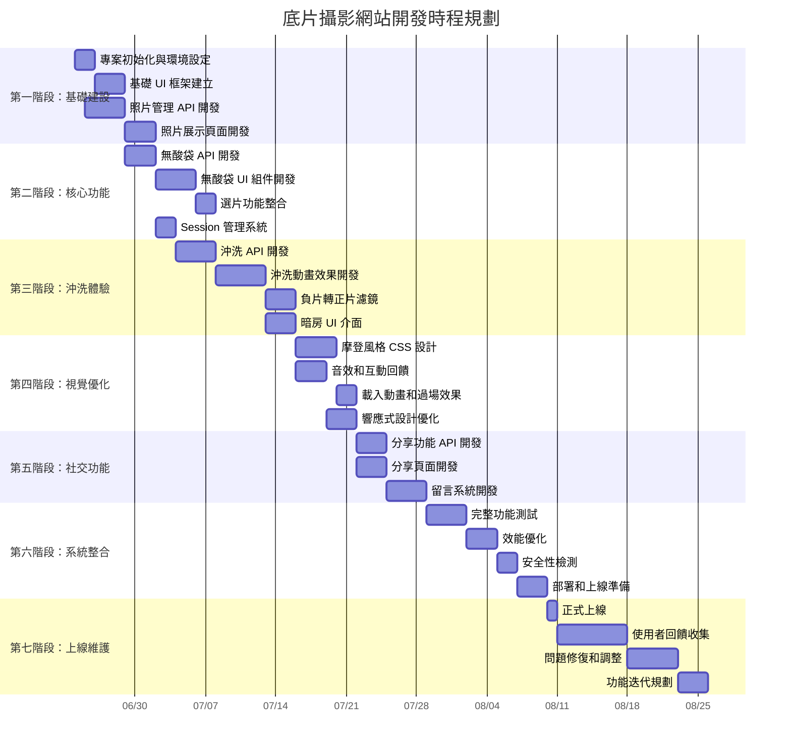

# JEBY 設計工作室網站

歡迎來到 JEBY 設計工作室的官方網站專案。本網站展示我們的創意設計服務，並提供一個互動平台來展示我們的作品和與客戶溝通。

## 功能特點

- 響應式設計，適配各種設備尺寸
- 多語言支援（繁體中文和英文）
- 視差滾動效果，提供獨特的視覺體驗
- 精選作品集展示

## 技術架構

- [Nuxt 3](https://nuxt.com/) - 基於 Vue.js 的框架
- [Tailwind CSS](https://tailwindcss.com/) - 用於快速樣式設計
- [i18n](https://i18n.nuxtjs.org/) - 實現多語言支援
- [Nodemailer](https://nodemailer.com/) - 處理郵件發送功能

## 開始使用

請確保您已安裝 [Node.js](https://nodejs.org/)（版本 14.x 或更高）。

1. 克隆此儲存庫：
   ```
   git clone https://github.com/jeby-228/JEBY-website.git
   ```

2. 安裝相依套件：
   ```
   npm install
   ```

3. 建立 `.env` 檔案並設置必要的環境變數：
   ```
   EMAIL_USER=your-email@example.com
   EMAIL_PASS=your-email-password
   ```

4. 啟動開發伺服器：
   ```
   npm run dev
   ```

5. 在瀏覽器中訪問 `http://localhost:3000`

## 部署

若要建立生產版本：

```
npm run build
```

關於部署的詳細資訊，請參考 [Nuxt 部署文件](https://nuxt.com/docs/getting-started/deployment)。

## 貢獻

我們歡迎各種形式的貢獻。如果您發現任何錯誤或有改進建議，請開啟一個 issue 或提交一個 pull request。

## 授權條款

本專案採用 [MIT 授權條款](LICENSE)。

## 聯絡我們

如有任何問題或建議，請透過我們網站上的聯絡表單與我們聯繫。


感謝您對 JEBY 設計工作室的支持與關注！



